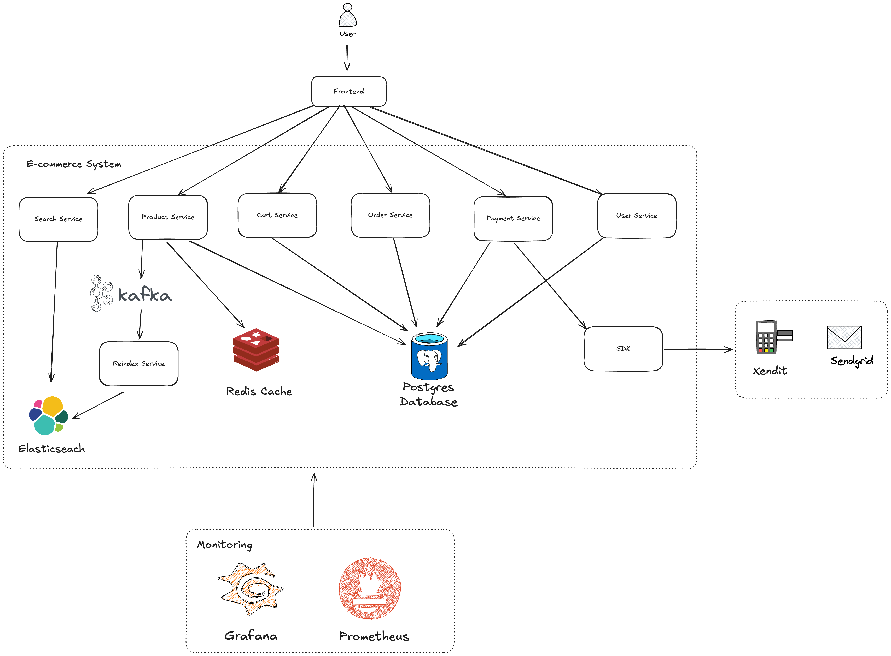

# ECOMMERCE BACKEND API

## ARCHITECTURE DIAGRAM


## SETUP AND RUN

1. Clone the repository
   ```shell
   git clone https://github.com/nurmuh-alhakim18/ecommerce.git
   cd ecommerce
   ```
2. Start all dependencies using Docker Compose
   ```shell
   docker-compose up -d
   ```
   This will start services such as PostgreSQL, Redis, and even the app itself
3. Run db migration using flyway
   ```shell
   mvn flyway:migrate
   ```
4. Access Swagger API Docs
   ```
   http://localhost:8000/api/v1/swagger-ui/index.html
   ```